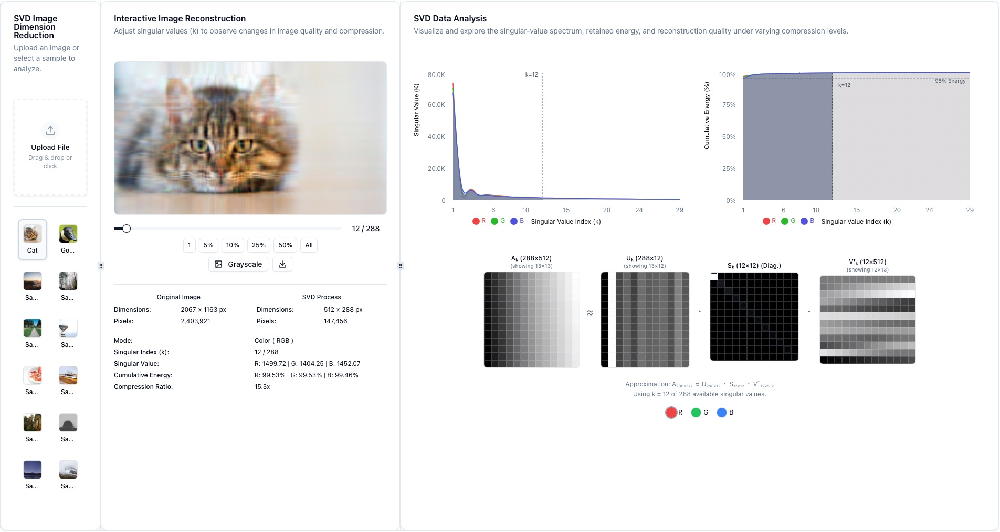

# SVD Image Analysis

A visual and interactive web tool to explore **Singular Value Decomposition (SVD)** on images. Understand how matrix approximation, compression ratio, and reconstruction quality evolve as singular values are progressively removed.


## ✨ Features

- 📊 Visualize the **Singular Value Spectrum**  
- ⚡ Track **Cumulative Energy Retention**  
- 🧩 Explore **Low-Rank Matrix Reconstruction**  
- 🎨 Supports both **Grayscale** and **RGB Color** SVD  
- 📷 Upload custom images or choose from sample images  
- 🎚 Interactive slider to control the number of singular values (k)  
- 📈 Visual comparison of reconstruction quality and compression ratio  

## 📸 Screenshots


## 🚀 Live Demo

👉 [Open in Vercel](https://svd-image.vercel.app)


## 🧠 What is SVD?

**Singular Value Decomposition (SVD)** expresses a matrix \(A\) as:

A = U·Σ·V^T


By truncating smaller singular values, we obtain a **low-rank approximation** of the original matrix—preserving its essential structure while reducing storage and computational complexity.


## 🛠️ Getting Started

```bash
# 1. Clone the repository
git clone https://github.com/8lovelife/svd-image.git
cd svd-image

# 2. Install dependencies
npm install

# 3. Start the server
npm run dev

```

## 📜 License
MIT License © 2025 [8lovelife]